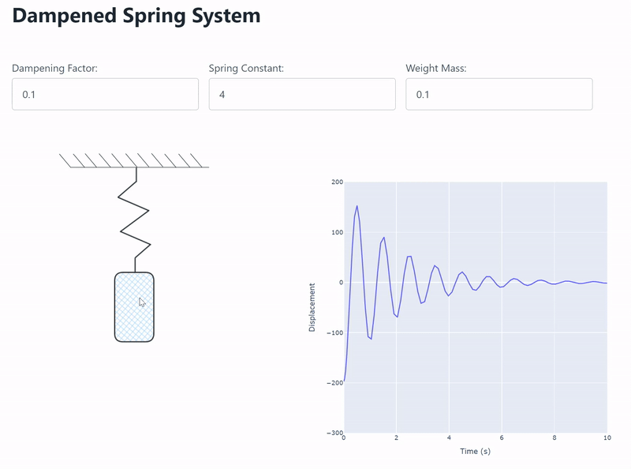

# Julia & htmx demo

This demo aims to explore the idea of [htmx](https://htmx.org/) as an alternative to "standard" dashboarding solutions and no-JS front-end tools common in the data & analytics industry. While some use cases are perfectly served by a static dashboard, others necessitate user inputs or otherwise a higher degree of interactivity. 

Data scientists & analysts are usually hesitant to learn a "proper" front-end framework but still have a need to quickly prototype and get user feedback. Frameworks like [Streamlit](https://streamlit.io/) do enable quick prototypes but tend to struggle as feature requirements get more complex. This is where htmx could fill a gap in the industry quite nicely, allowing for more flexibility and performance but with a fairly low barrier to entry.

## Overview 
The back-end is an ODE (Ordinary Differential Equation) solver & server written in Julia, modelling a dampened spring system governed by a second-order equation:
```math
my'' + by' + ky = 0
```
where m is the mass of the attached object, b is the dampening constant and k is the spring constant.

The htmx front-end is an interactive drawing of said spring system, allowing the user to drag the weight on the end of the spring up and down. On release, the initial conditions are sent to the server, which solves the second-order ODE, before sending plots and animation parameters back to the client, triggering an animation of the spring bounce to play. Plotly in particular combines well with htmx as it allows for a direct HTML export of its charts. 

This project demonstrates that htmx is both a simple and powerful visualisation tool when combined with high-level modelling languages. It offers the opportunity for more customiseable and interactive front-ends while keeping the complexity overhead to a minimum.

# Running the demo

Install [Julia](https://julialang.org/) and run `./run.sh` on your terminal or run `app.jl` through the Julia REPL after installing the packages.

